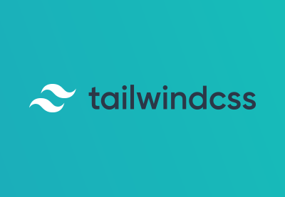

# About

## MATERIAL-UI

### React components for fast and easy web development. Create your own design or start with Material Design.

(russian language)
### React компоненты для быстрой и легкой веб-разработки. Создайте свой собственный дизайн или начните с Material Design.

## Ant Design

### Help designers/developers building beautiful products more flexible and working with happiness

(russian language)
### Помогите дизайнерам/разработчикам создавать красивые продукты более гибко и работать с удовольствием

## Visual primitives for the component age.Use the best bits of ES6 and CSS to style your apps without stress

(russian language)
### Визуальные примитивы для возраста компонентов.Используйте лучшие элементы ES6 и CSS, чтобы стилизовать свои приложения без стресса.

.png)

## Tailwind

### “Tailwind CSS is the only framework that I've seen scale on large teams. It’s easy to customize, adapts to any design, and the build size is tiny.” 

(russian language)
### «Tailwind CSS — единственный фреймворк, который я видел в больших командах. Его легко настроить, он адаптируется к любому дизайну, а размер сборки крошечный».

